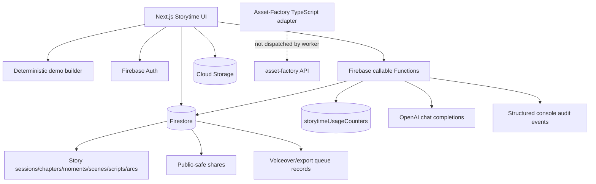
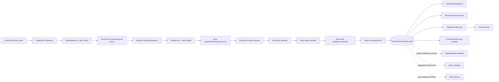

# URAI Storytime architecture

Last reconciled: 2026-07-06  
Evidence baseline: `main@af3b97166b23c55618ae3cdd91a96bb035fd40f2`

## Current classification

URAI Storytime is a Next.js/Firebase internal-alpha product with a deterministic demo fallback. The active application is under `src/app`, `src/components/storytime`, and `src/lib`. Files such as `src/app.js`, `src/index.html`, and `src/story-engine.mjs` belong to the older static/hash-router implementation and are not the canonical runtime.

## Current runtime architecture

## Active frontend surfaces

- `/` redirects to `/storytime`.
- `/storytime` contains Firebase account UI, cloud library, and story-seed form.
- `/storytime/settings` is a read-only description of effective defaults.
- `/storytime/demo` renders a deterministic, non-persisted story.
- `/storytime/[sessionId]` reads an authenticated cloud session.
- `/share/story/demo` shows the public-share boundary.
- `/share/story/[shareId]` reads a redacted public-safe share when enabled.

There are no active Next API routes. Backend operations are Firebase callable Functions.

## Callable boundary

### Implemented but not live-verified

- `generateStorySession`
- `createPublicStoryShare`
- `revokePublicStoryShare`
- `prepareVoiceoverJob` (queue records only)

### Placeholder hooks

- `generateNarratorScript`
- `generateEmotionalArcSummary`
- `generateWeeklyStoryScroll`
- `refreshStoryTimeline`
- `rebuildUserStoryArchive`

A callable name existing is not evidence that its business process exists.

## Current data ownership

Storytime owns:

- story requests and generation jobs;
- sessions, chapters, moments, scenes, narrator scripts, and emotional arcs;
- user Storytime preferences;
- public-safe derivatives and share lifecycle;
- Storytime export/voiceover job metadata;
- consent, safety, provider, cost, and provenance receipts for Storytime operations.

Storytime must not own raw canonical Life Map, relationship, location, health, or calendar records. Future integrations receive a minimum-necessary, purpose-bound snapshot through versioned APIs.

## Current collections

Active or source-wired collections include:

- `storySessions`
- `storyChapters`
- `storyMoments`
- `memoryScenes`
- `narratorScripts`
- `emotionalArcSummaries`
- `publicStoryShares`
- `voiceoverJobs`
- `storyExports`
- `timelineReplayEvents`
- `storytimeUsageCounters`

Family-oriented scaffolding also references `users`, `families`, `childProfiles`, `stories`, `storyRuns`, `moderation`, `auditLogs`, and `privacyRequests`, but the active UI/Functions do not yet provide a complete family workspace lifecycle.

## Trust boundaries

1. **Browser:** untrusted. Client feature flags and validation are UX only.
2. **Firebase Auth token:** establishes identity, not product consent or guardian authority.
3. **Callable Function:** must enforce schema, consent, age/guardian policy, entitlement, cost, safety, and object authorization.
4. **Firestore/Storage rules:** final client-access boundary; every supported query requires behavioral tests.
5. **Provider:** receives only approved minimum-necessary content and returns untrusted output.
6. **Asset Factory/media provider:** separate job and cost boundary; never invoked implicitly by text generation.
7. **Public share:** contains only a redacted derivative, never a pointer that exposes private records.
8. **URAI ecosystem:** integrations use versioned contracts, service identity, explicit purpose, and revocation.

## Recommended production architecture

## Generation contract

Every generation request should include:

- authenticated adult/guardian identity;
- idempotency key;
- story format and schema version;
- audience/age band;
- language, tone, length, and reading level;
- explicit source list and consent snapshot version;
- safety policy version;
- maximum token and monetary budget;
- optional approved memory snapshot references;
- output destinations that are disabled by default.

Every result should record:

- immutable input hash and request version;
- provider/model/version and timestamps;
- token/usage/cost receipt;
- pre/post safety results;
- source/provenance references;
- generated story version and asset IDs;
- retry/partial failure history;
- deletion/retention class.

## Public-share contract

A public share is a separate derivative record with:

- server-generated ID and slug;
- owner and source story version;
- explicit consent and policy version;
- redaction/moderation receipt;
- server timestamp `createdAt`, `expiresAt`, and optional `revokedAt`;
- active/revoked/expired state enforced by server/rules;
- no private story body, source signals, family graph, provider prompts, or private asset URLs;
- revocation semantics for CDN/browser caches and search-engine indexing.

## Ecosystem API boundaries

| Integration | Contract |
|---|---|
| `urai-privacy` | `POST export`, `POST delete`, retention status, consent ledger; Storytime remains data owner |
| `urai-jobs` | idempotent job create/status/cancel/event contract; no raw secret sharing |
| `asset-factory` | versioned media manifest, signed service auth, budget, receipt, private output paths |
| `urai-analytics` | allow-listed aggregate events; no prompts, story bodies, names, child data, or media |
| `urai-admin` | least-privilege moderation cases and server-written audit events |
| Life Map/Focus/Mirror/relationships/locations | explicit consent-scoped snapshots with provenance and revocation |
| Replay/`urai-spatial` | redacted/versioned scene manifest and signed asset access |
| Passport | immutable provider, consent, source, and asset receipts |

## Reliability requirements

- request idempotency and duplicate suppression;
- transactional state transitions;
- timeouts, bounded retry/backoff, and circuit breakers;
- user-visible progress, cancellation, and safe retry;
- dead-letter/manual-recovery path;
- no partial story marked `ready`;
- generated media is a separate job from story text;
- all logs exclude raw private content and secrets;
- monitoring, cost alerts, backups, restore drills, and tested rollback.

## Legacy migration

Before deleting the old static implementation:

1. inventory unique demo behavior and tests;
2. migrate any still-required local-only story/library/narration behavior into explicit Next adapters;
3. move retained historical code to `legacy/static-demo/` with a non-canonical README, or delete it;
4. remove obsolete build/preview scripts and stale documentation references;
5. prove active routes/tests/build are unchanged.

## Architecture decision gates

The following require explicit owner/legal/product decisions before implementation:

- adult-only versus child-directed launch posture;
- guardian verification and family membership model;
- provider and model allow-list;
- provider data-retention/training terms;
- public-sharing availability;
- billing/credits/paid media generation;
- retention/deletion/backups;
- voice/photo/likeness and third-party subject consent;
- classroom/creator modes;
- spatial sensor/camera/microphone permissions.
