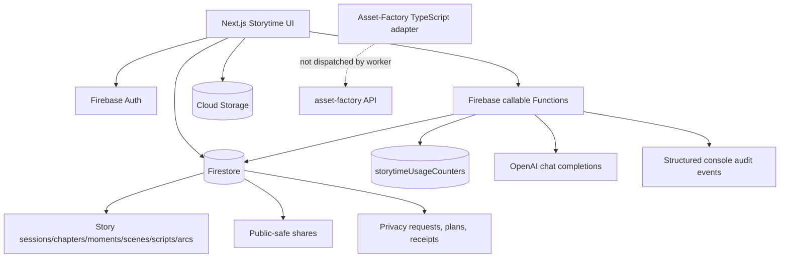
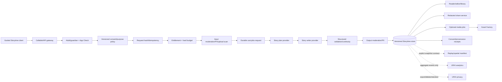

# URAI Storytime architecture

Last reconciled: 2026-07-06  
Evidence baseline: `main@af3b97166b23c55618ae3cdd91a96bb035fd40f2`

## Current classification

URAI Storytime has one canonical application runtime: the Next.js/Firebase product under `src/app`, `src/components/storytime`, and `src/lib/storytime`, with Firebase callable Functions under `functions/src`. The historical deterministic static engine has been removed from the canonical `src/` root and is retained only under `legacy/static-demo/` for regression/history purposes.

## Current runtime architecture

```mermaid
flowchart TB
  Browser[Next.js Storytime UI]
  Browser --> Auth[Firebase Auth]
  Browser --> FS[(Firestore)]
  Browser --> Fn[Firebase callable Functions]
  Browser --> Storage[(Cloud Storage)]

  Fn --> Quota[(storytimeUsageCounters)]
  Fn --> OpenAI[OpenAI chat completions]
  Fn --> FS
  Fn --> Logs[Structured console audit events]

  FS --> Sessions[Story sessions/chapters/moments/scenes/scripts/arcs]
  FS --> Shares[Public-safe shares]
  FS --> Privacy[Privacy requests, plans, receipts]

  Adapter[Asset-Factory TypeScript adapter] -. not dispatched by worker .-> AssetFactory[asset-factory API]
```

## Active frontend surfaces

- `/` redirects to `/storytime`.
- `/storytime` contains Firebase account UI, cloud library, and story-seed form.
- `/storytime/settings` is a read-only description of effective defaults.
- `/storytime/[sessionId]` reads an authenticated cloud session.
- `/share/story/[shareId]` reads a redacted public-safe share when enabled.

There are no active Next API routes. Backend operations are Firebase callable Functions.

## Callable boundary

### Implemented in source, not live-certified

- `generateStorySession` — governed cloud story generation.
- `createPublicStoryShare` / `revokePublicStoryShare` — content-neutral public derivative lifecycle.
- `generateNarratorScript` — deterministic repository-owned record, completed synchronously.
- `generateEmotionalArcSummary` — deterministic repository-owned record, completed synchronously.
- `generateWeeklyStoryScroll` — deterministic repository-owned record, completed synchronously.
- `refreshStoryTimeline` — ownership-checked timeline persistence.
- `rebuildUserStoryArchive` — bounded archive snapshot rebuild.
- Storytime privacy request/export/deletion-plan callables — bounded by privacy and environment gates.
- `prepareVoiceoverJob` — intentionally fail-closed; no media queue is created until a governed worker exists.

Callable source existence still does not prove deployed/runtime readiness.

## Current data ownership

Storytime owns:

- story requests and generation jobs;
- sessions, chapters, moments, scenes, narrator scripts, and emotional arcs;
- user Storytime preferences;
- public-safe derivatives and share lifecycle;
- Storytime privacy/export evidence and hard-off media integration metadata;
- consent, safety, provider, cost, and provenance receipts for Storytime operations.

Storytime must not own raw canonical Life Map, relationship, location, health, or calendar records. Future integrations receive a minimum-necessary, purpose-bound snapshot through versioned APIs.

## Current collections

Active or source-wired collections include:

- `storySessions`
- `storyChapters`
- `storyMoments`
- `memoryScenes`
- `narratorScripts`
- `emotionalArcSummaries`
- `publicStoryShares`
- `timelineReplayEvents`
- `storyArchiveSnapshots`
- `privacyRequests`
- `privacyDeletionPlans`
- `privacyCompletionReceipts`
- `storytimeUsageCounters`

Family-oriented scaffolding also references `users`, `families`, `childProfiles`, `stories`, `storyRuns`, `moderation`, `auditLogs`, and `privacyRequests`, but the active UI/Functions do not yet provide a complete family workspace lifecycle.

## Trust boundaries

1. **Browser:** untrusted. Client feature flags and validation are UX only.
2. **Firebase Auth token:** establishes identity, not product consent or guardian authority.
3. **Callable Function:** must enforce schema, consent, age/guardian policy, entitlement, cost, safety, and object authorization.
4. **Firestore/Storage rules:** final client-access boundary; every supported query requires behavioral tests.
5. **Provider:** receives only approved minimum-necessary content and returns untrusted output.
6. **Asset Factory/media provider:** separate job and cost boundary; never invoked implicitly by text generation.
7. **Public share:** contains only a redacted derivative, never a pointer that exposes private records.
8. **URAI ecosystem:** integrations use versioned contracts, service identity, explicit purpose, and revocation.

## Recommended production architecture

```mermaid
flowchart LR
  UI[Guided Storytime client]
  UI --> Gateway[Callable/API gateway]
  Gateway --> Identity[Adult/guardian + App Check]
  Identity --> Consent[Versioned consent/purpose policy]
  Consent --> Idempotency[Request hash/idempotency]
  Idempotency --> Budget[Entitlement + hard budget]
  Budget --> PreSafety[Input moderation/PII/upload scan]
  PreSafety --> Queue[Durable urai-jobs request]
  Queue --> Planner[Story plan provider]
  Planner --> Writer[Story writer provider]
  Writer --> Schema[Structured validation/continuity]
  Schema --> PostSafety[Output moderation/PII]
  PostSafety --> Versioned[(Versioned Storytime store)]
  Versioned --> Reader[Reader/editor/library]
  Versioned --> Share[Redacted share service]
  Versioned --> Media[Optional media jobs]
  Media --> AF[Asset Factory]
  Versioned --> Passport[Consent/provenance receipts]
  Versioned -. explicit snapshot contract .-> Spatial[Replay/spatial manifest]
  Versioned -. aggregate events only .-> Analytics[URAI analytics]
  Versioned -. export/delete/retention .-> Privacy[URAI privacy]
```

## Generation contract

Every generation request should include:

- authenticated adult/guardian identity;
- idempotency key;
- story format and schema version;
- audience/age band;
- language, tone, length, and reading level;
- explicit source list and consent snapshot version;
- safety policy version;
- maximum token and monetary budget;
- optional approved memory snapshot references;
- output destinations that are disabled by default.

Every result should record:

- immutable input hash and request version;
- provider/model/version and timestamps;
- token/usage/cost receipt;
- pre/post safety results;
- source/provenance references;
- generated story version and asset IDs;
- retry/partial failure history;
- deletion/retention class.

## Public-share contract

A public share is a separate derivative record with:

- server-generated ID and slug;
- owner and source story version;
- explicit consent and policy version;
- redaction/moderation receipt;
- server timestamp `createdAt`, `expiresAt`, and optional `revokedAt`;
- active/revoked/expired state enforced by server/rules;
- no private story body, source signals, family graph, provider prompts, or private asset URLs;
- revocation semantics for CDN/browser caches and search-engine indexing.

## Ecosystem API boundaries

| Integration | Contract |
|---|---|
| `urai-privacy` | `POST export`, `POST delete`, retention status, consent ledger; Storytime remains data owner |
| `urai-jobs` | idempotent job create/status/cancel/event contract; no raw secret sharing |
| `asset-factory` | versioned media manifest, signed service auth, budget, receipt, private output paths |
| `urai-analytics` | allow-listed aggregate events; no prompts, story bodies, names, child data, or media |
| `urai-admin` | least-privilege moderation cases and server-written audit events |
| Life Map/Focus/Mirror/relationships/locations | explicit consent-scoped snapshots with provenance and revocation |
| Replay/`urai-spatial` | redacted/versioned scene manifest and signed asset access |
| Passport | immutable provider, consent, source, and asset receipts |

## Reliability requirements

- request idempotency and duplicate suppression;
- transactional state transitions;
- timeouts, bounded retry/backoff, and circuit breakers;
- user-visible progress, cancellation, and safe retry;
- dead-letter/manual-recovery path;
- no partial story marked `ready`;
- generated media is a separate job from story text;
- all logs exclude raw private content and secrets;
- monitoring, cost alerts, backups, restore drills, and tested rollback.

## Legacy status

The old deterministic static Storytime engine is archived under `legacy/static-demo/`. Production build/deploy paths do not import it. Its retained unit test targets the archived path only.

The canonical source rule is: **production Storytime code belongs to the Next.js/Firebase application and Functions surfaces, never the legacy directory.**

## Architecture decision gates

The following require explicit owner/legal/product decisions before implementation:

- adult-only versus child-directed launch posture;
- guardian verification and family membership model;
- provider and model allow-list;
- provider data-retention/training terms;
- public-sharing availability;
- billing/credits/paid media generation;
- retention/deletion/backups;
- voice/photo/likeness and third-party subject consent;
- classroom/creator modes;
- spatial sensor/camera/microphone permissions.
