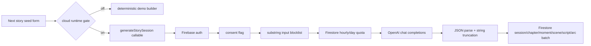

# URAI Storytime evidence audit — 2026-07-06

Repository: `LifeLoggerAI/urai-storytime`  
Canonical branch: `main`  
Audited head: `af3b97166b23c55618ae3cdd91a96bb035fd40f2`  
Audit branch: `audit/2026-07-06-production-truth`

## Executive truth

URAI Storytime is a **production-shaped internal alpha**, not a production-ready service. The repository contains a real Next.js 15 / React 19 application, Firebase Auth client wiring, Firestore/Storage rules, callable Functions, an OpenAI story provider adapter, public-share creation/revocation, an Asset-Factory adapter, CI workflows, validation scripts, and a deterministic demo. The core cloud journey has not been proven against an isolated staging or production Firebase environment.

The highest-risk gaps are not cosmetic:

1. `.firebaserc` still points at `REPLACE_WITH_URAI_STORYTIME_STAGING`.
2. Current `main` has no attached CI status or workflow-run receipt.
3. Firestore emulator behavior has a written specification but no recorded execution receipt for current head.
4. The child/family promise exceeds the implementation: the UI accepts an age range, the server schema ignores it, and no guardian/child-profile lifecycle is active.
5. Story generation uses a small substring blocklist and has no output moderation, provider timeout, retry, idempotency key, cancellation, durable job state, cost receipt, or model-response provenance.
6. Five callable functions return hard-coded `queued` messages, and voiceover/export preparation writes queue records without dispatching a provider job.
7. Public-share expiration is checked in the browser only; rules do not enforce expiration.
8. Account export, account deletion, story deletion, retention, recovery, password reset, email verification, and guardian consent are absent from the active Next.js product.
9. The repository retains an older static/hash-router product beside the Next application, and several architecture/roadmap documents still describe that retired baseline.

## Source of truth

Use the following precedence when sources conflict:

1. `main` source code and configuration at the audited SHA.
2. GitHub Actions results tied to an exact SHA.
3. `launch-proof/` records tied to an exact SHA and external receipt.
4. Current operational docs.
5. Historical roadmap/audit documents.
6. High-level Google Drive vision documents.

Google Drive search found broad system-of-systems and portfolio material, but no more specific Storytime implementation specification than the repository. The repository is therefore canonical for current behavior.

## Repository and release facts

| Area | Verified state | Evidence |
|---|---|---|
| Access | Public repository; authenticated operator has admin/write access | GitHub repository metadata |
| Default branch | `main` | repository metadata |
| Current head | `af3b97166b23c55618ae3cdd91a96bb035fd40f2` | latest commit search/fetch |
| Package | `urai-storytime@2.5.0` | `package.json` |
| App stack | Next.js 15.3, React 19.1, TypeScript 5.8, Zod 3.25 | `package.json` |
| Backend | Firebase client/admin, Functions v2, Firestore, Storage | `package.json`, `functions/package.json`, `firebase.json` |
| Node | CI and Functions use Node 24 | workflows, `functions/package.json` |
| Package manager | npm, but no committed root or Functions lockfile | missing `package-lock.json` files |
| Production URL | `https://www.uraistorytime.com` is named only as an unverified target | `README.md` |
| Firebase target | Placeholder; not deployable as production truth | `.firebaserc` |
| Deployed SHA | Unknown / no receipt | release evidence and launch-proof records |
| Rollback SHA | Unknown; no production deployment baseline | release evidence and rollback docs |
| Latest direct CI evidence | PR #12 run `26130875564` passed app/functions jobs; production-only job skipped | `docs/RELEASE_EVIDENCE_LOG.md` and GitHub run jobs |
| Current-head CI | No status checks or workflow runs attached to audited head | GitHub status/run lookup |
| Tags/releases | No release evidence was found in available repository operations | connector audit |

## Active routes and capabilities

| Route/capability | Purpose | Current implementation | Verification | Missing work | Severity | Milestone |
|---|---|---|---|---|---|---|
| `/` | Entry | Redirects to `/storytime` | Source verified | Live/domain smoke | Medium | P0 |
| `/storytime` | Account, library, story seed | Real Next client surface; deterministic demo and gated cloud callable | Source + static tests | explicit generation consent, richer wizard, live auth/provider proof | Critical | P0/P1 |
| `/storytime/settings` | Privacy/narrator settings | Read-only explanatory cards | Source verified | persisted settings, guardian controls, deletion/export | High | P1 |
| `/storytime/demo` | Local deterministic story | One chapter/moment/scene; not persisted | Source verified | UX polish and accessibility/manual QA | Medium | P1 |
| `/storytime/[sessionId]` | Cloud session reader | Auth listener; reads session, chapters, scenes, scripts, arc | Source verified | live owner/non-owner tests, robust retry, version history, editing | Critical | P0/P1 |
| `/share/story/demo` | Public-share shell | Clearly labeled demo | Source verified | browser/manual QA | Low | P1 |
| `/share/story/[shareId]` | Public redacted share | Firestore query by slug; revoked/expired UI states | Source verified; query repaired on audit branch | server/rules expiration enforcement and live create/fetch/revoke proof | Critical | P0 |
| Email/password auth | Account creation/sign-in | Firebase client calls | Source verified | email verification, reset, abuse protection, legal/age flow, live proof | Critical | P0/P1 |
| Cloud story generation | Create and persist story graph | Callable enforces auth/consent/quota and persists one chapter graph | Source verified | age-aware schema, output moderation, durable job state, provider receipts | Critical | P0/P1 |
| Library | List recent saved sessions | Last eight sessions, owner query | Source verified | pagination/search/delete/archive/version history | High | P1 |
| Public sharing | Create/revoke redacted share | Authenticated callables and owner checks | Source verified | reliable redaction, expiry enforcement, live rules proof, revocation cache strategy | Critical | P0 |
| Narrator | Narrator text display | Text-only component | Source verified | audio playback, captions, voices, timing, accessibility | High | P1/P2 |
| Voiceover/export | Queue records | Writes `voiceoverJobs` and `storyExports`; no dispatch | Partial | provider job dispatch, polling, cancellation, receipts, download | High | P1/P2 |
| Asset Factory | HTTP adapter and mappers | Adapter functions exist, not called by production worker | Partial | authenticated E2E contract, timeout/retry/idempotency, ingestion worker | High | P2 |
| Admin/moderation | Governance | Rules/types/docs only | Planned/scaffold | role provisioning, moderation queue UI, immutable audit trail | Critical | P1 |
| Billing/credits | Entitlements/cost recovery | No active implementation | Absent | product decision and implementation if needed | Medium | P2 |

There are no active Next API routes. The backend API surface is Firebase callable Functions exported from `functions/src/index.ts`.

## Callable Function truth table

| Function | Status | Evidence/behavior |
|---|---|---|
| `generateStorySession` | Implemented, unverified live | Auth, input schema, consent, quota, provider gate, Firestore batch |
| `createPublicStoryShare` | Implemented, unverified live | Owner session lookup, redaction, TTL field, share record, session visibility update |
| `revokePublicStoryShare` | Implemented, unverified live | Owner check, revoked flag, session privacy restore, timeline event |
| `prepareVoiceoverJob` | Partial | Writes queued records only; does not call TTS or Asset Factory |
| `generateNarratorScript` | Placeholder | Returns hard-coded `queued` response |
| `generateEmotionalArcSummary` | Placeholder | Returns hard-coded `queued` response |
| `generateWeeklyStoryScroll` | Placeholder | Returns hard-coded `queued` response |
| `refreshStoryTimeline` | Placeholder | Returns hard-coded `queued` response |
| `rebuildUserStoryArchive` | Placeholder | Returns hard-coded `queued` response |

## Story format matrix

Legend: **I** implemented, **P** partial/scaffold, **A** absent, **R** recommended, **N** not appropriate for core V1.

### Audiences

| Audience | State | Notes |
|---|---|---|
| Families/adults | P | Product copy and family-safe prompts exist; family workspace is not active |
| Young/older children | P | UI has age bands but backend ignores them; no guardian lifecycle |
| Teenagers | A/R | No age-specific policy or experience |
| Couples/caregivers | A/R | Relationship data models exist but no journey |
| Classrooms | A/R | Requires separate consent, tenancy, and educator controls |
| Bedtime | P | Narrative positioning exists; no actual bedtime audio mode |
| Accessibility-focused users | P | semantic HTML exists; no completed screen-reader/keyboard/caption audit |
| Legacy/memorial | P/R | reflective memory language exists; consent/rights workflow absent |

### Story types

| Type | State | Notes |
|---|---|---|
| Reflective/private memory story | I/P | Core one-chapter flow exists; provider not live-proven |
| Bedtime story | P | Deterministic/static legacy flow and copy exist |
| Personalized adventure/education/SEL/calming | A/R | Need schemas and age policy |
| Family history/legacy/pet/travel/holiday | A/R | Need guided templates and consent boundaries |
| Choose-your-own/branching/serialized/chapter book | A/R | No graph/version/continuity engine |
| Poems/rhymes/songs/lullabies | A/R | No format contract or rights policy |
| Comic/illustrated book/audio drama/video | P | Asset Factory adapter only; no completed output |
| AR/VR/spatial story | A/R | Future integration with `urai-spatial` |
| Grief/remembrance/therapeutic-adjacent | R with safeguards | Requires careful non-clinical policy and counsel review |

### Inputs

| Input | State |
|---|---|
| Typed title/theme/mood/source text | I |
| Guided age range | P; ignored by server |
| URAI memory/life-map data | Planned only |
| Voice/photo/drawing/document upload | A |
| Family tree/relationship/place/calendar data | A/planned |
| Existing story import | A |
| Collaborative contributions | A |

### Outputs

| Output | State |
|---|---|
| Web reader/mobile responsive page | P |
| Public private-safe link | P |
| Narrator text | I |
| Browser/TTS audio | A in active Next app; queue scaffold only |
| Printable PDF/EPUB/audiobook/audio download | A |
| Illustrated book/comic/video/slideshow | P adapter only |
| Interactive/spatial/AR/VR | A |
| Physical-book-ready export | A |

## Existing generation architecture

## Recommended production generation architecture

## Provider and cost-control findings

Implemented:

- Provider disabled by default.
- OpenAI key/model required when provider is `openai`.
- Hourly and daily generation counters.
- Production deterministic fallback disabled.
- JSON-only provider request and bounded string extraction.

Missing:

- timeout/abort, retry policy, circuit breaker, cancellation;
- request idempotency and duplicate prevention;
- per-request token/output ceiling and monetary budget;
- provider usage/cost receipt and model/version provenance;
- output moderation and PII scan;
- age-aware prompt and policy enforcement;
- full schema validation of provider output;
- partial-generation recovery and job state;
- cache policy and deterministic replay inputs;
- separate explicit cost gate for image/audio/video generation.

No paid provider call was made during this audit.

## Privacy, child safety, and security findings

### Critical/high

1. Age range is collected by the client but absent from `GenerateStorySchema`; it is not persisted or used by the provider prompt.
2. The create form sends `storyGeneration: true` without a dedicated explicit consent control.
3. Public share expiry is a string checked client-side; rules only enforce `revoked == false`.
4. Public redaction is regex-based and cannot reliably remove all names, locations, schools, rare identifiers, or contextual identity clues.
5. No guardian/parent verification, child profile ownership flow, age gate, family-member consent, photo/voice consent, or minor-specific retention policy.
6. Account and story deletion are not implemented; several Firestore collections explicitly deny deletion.
7. No export-rights workflow, retention worker, backup/restore evidence, breach/incident process, or access-review record.
8. `auditLogs` permits any signed-in client to create an audit record; authoritative security audit logs should be server-written and tamper-resistant.
9. Storage accepts writes based on a custom `familyIds` claim, but no claim-provisioning/refresh path or emulator proof is recorded.
10. Provider data handling, training-use claims, and subprocessor disclosures are not represented as verified product policy.

Legal questions involving COPPA, state child privacy laws, biometric/voice treatment, copyright, publicity rights, family-member consent, and international privacy require qualified counsel. This audit does not claim compliance.

## UX and accessibility findings

Strengths:

- Honest demo/cloud gating and private-by-default copy.
- Basic loading, empty, signed-out, not-found, and error states.
- Bounded inputs and disabled submit styling.
- Simple responsive card system and semantic labels.

Gaps:

- Main creation flow is a short technical form, not a polished guided story builder.
- No character/family/pet/place builder, preview/edit/regenerate, draft saving, or section controls.
- Story reader is static text; no playback timeline, narration controls, captions, focus mode, progress, illustrations, or scene transitions.
- Settings are read-only and can be mistaken for controls despite explanatory copy.
- Raw Firebase/provider errors can reach users.
- No password reset, email verification, account recovery, support/reporting, or safety-report flow.
- No completed keyboard, screen-reader, contrast, reduced-motion, zoom, mobile-device, or cross-browser receipts.

## Engineering quality and tests

Verified historical evidence:

- PR #12 run `26130875564` passed install, lint/typecheck, tests, smoke/static checks, build, and Functions build.
- Production-only evidence job was skipped because it was a PR run.

Current-head status:

- no combined statuses;
- no workflow runs returned for audited head;
- local clone/install/build could not be executed in this audit environment because direct GitHub network resolution was unavailable;
- no lockfiles are committed, so `npm ci` cannot be the deterministic default.

The existing `test:e2e` is a source-inspection smoke script, not browser E2E. There is no Playwright/Cypress/browser runner, no accessibility automation, no performance test, no dependency/security scan workflow, and no executable emulator behavior suite proving rules.

## Deployment and operations readiness

| Gate | Status | Reason |
|---|---|---|
| Source build history | PASS, stale | PR #12 receipt only |
| Current-head CI | FAIL/unknown | no run/status attached |
| Lockfile/reproducible install | FAIL | no lockfiles |
| Firebase isolated project | FAIL | placeholder target |
| Rules static checks | PASS, source only | validators exist |
| Rules behavioral tests | BLOCKED | no emulator execution receipt |
| Staging deploy | FAIL | no receipt |
| Production deploy | FAIL | no receipt |
| Domain/DNS/SSL | UNKNOWN | target named, not verified |
| Provider generation | BLOCKED | secrets/cost approval and smoke absent |
| Public share E2E | BLOCKED | no deployed create/read/revoke receipt |
| Export/voiceover | FAIL | queue-only |
| Monitoring/alerts | FAIL | structured console events only |
| Backup/disaster recovery | UNKNOWN | no evidence |
| Rollback | FAIL | no deployed SHA or tested rollback |
| Legal/privacy/child safety approval | BLOCKED | counsel/owner action required |

## Duplicate/conflicting implementations

- Active Next.js App Router product: `src/app/**`, `src/components/storytime/**`, `src/lib/**`.
- Legacy static/hash-router product: `src/index.html`, `src/app.js`, `src/story-engine.mjs`, local persistence and preview scripts.
- Historical docs still describe the static product as the baseline.

The legacy implementation should be explicitly archived under `legacy/` or removed after its unique tests/behavior are migrated. It should not remain an ambiguous second product root.

## Ecosystem integration map

| System | Current state | Required boundary |
|---|---|---|
| `asset-factory` | Adapter only | signed service contract, idempotent jobs, cost gate, receipts, private asset ownership |
| `urai-spatial` / Replay | Planned | versioned redacted story manifest; no direct private Firestore access |
| `urai-studio` | Issue-level coordination only | orchestration contract; Storytime owns story records |
| `urai-content` | Planned | publish only explicit public-safe derivatives |
| `urai-privacy` | Missing | export/delete/retention/consent APIs |
| `urai-analytics` | Planned | aggregate consent-safe events; never raw story text |
| `urai-jobs` | Missing/recommended | durable async generation/media jobs |
| `urai-marketing` | Planned | demo/public-safe assets only |
| Life Map/Focus/Mirror/Ground/location/relationship graph | Planned | explicit per-source consent, minimum necessary redacted snapshot, revocable linkage |
| Passport | Recommended | provenance, consent snapshot, provider and asset receipts |

## Exact launch blockers

1. Current-head CI and verification artifact.
2. Committed lockfiles and deterministic install.
3. Isolated Firebase staging and production IDs/targets.
4. Executed Auth/Firestore/Storage emulator behavior tests.
5. Live auth lifecycle and owner/non-owner authorization proof.
6. Server-enforced age/guardian/consent policy.
7. Provider timeout/retry/idempotency/output-safety/cost receipt controls.
8. Server-enforced public share expiration and tested revoke behavior.
9. Account/story export, deletion, retention, and revocation workflows.
10. Completed voiceover/export pipeline or explicit launch disablement.
11. Browser/mobile/accessibility/performance QA.
12. Monitoring, alerting, backup, incident, deployment, and rollback receipts.
13. Legal/privacy/child-safety review.
14. Verified domain, DNS, SSL, production URL, deployed SHA, and rollback SHA.

## Readiness score

| Category | Score |
|---|---:|
| Repository architecture | 72/100 |
| Core story UX | 45/100 |
| AI generation | 42/100 |
| Data/auth/privacy | 38/100 |
| Child safety/trust | 30/100 |
| Sharing | 50/100 |
| Media/export | 25/100 |
| Testing/quality | 48/100 |
| Deployment/operations | 18/100 |
| Ecosystem integration | 22/100 |
| Overall | **39/100** |

## Production readiness verdict

**Internal alpha.** The deterministic demo is runnable and the cloud architecture is meaningful, but the real cloud product, child/family safety model, provider pipeline, sharing boundary, media outputs, and deployment operations are not sufficiently evidenced for external beta or production.
