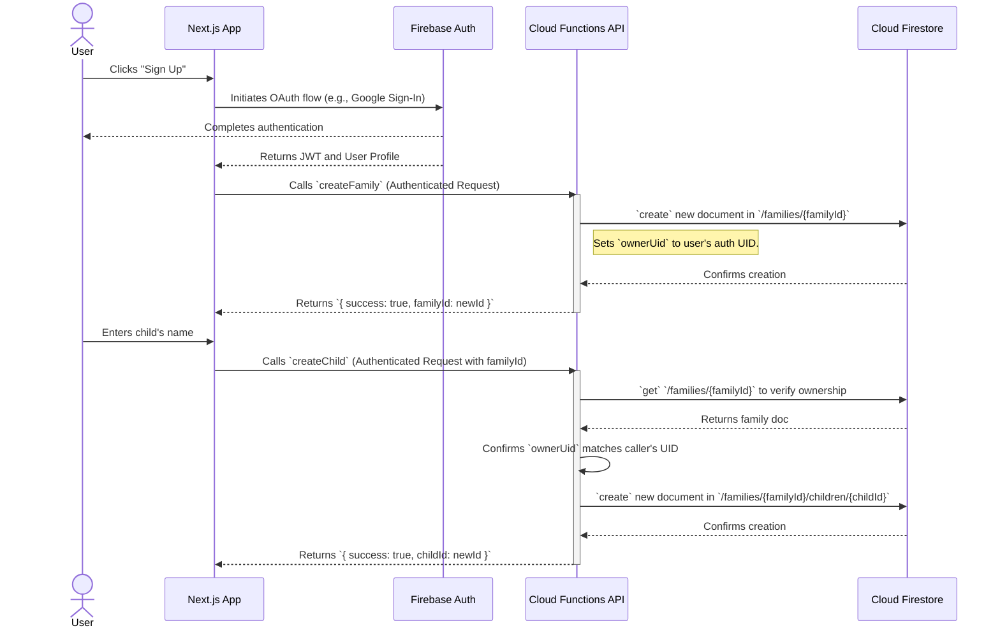
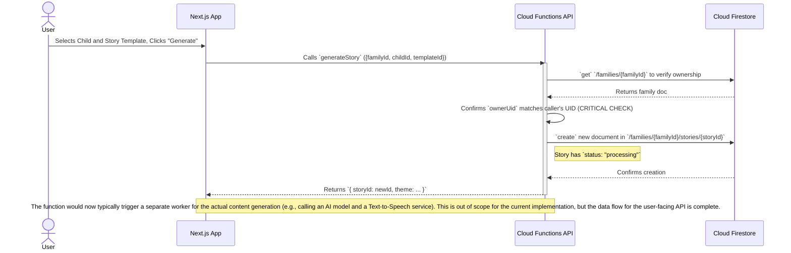
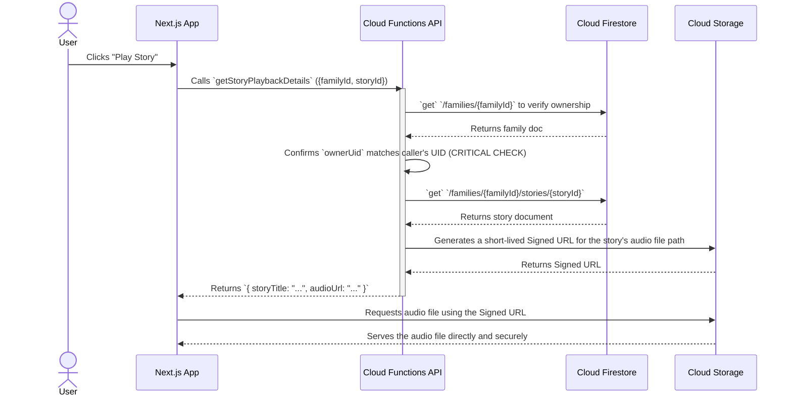

# Data Flow Diagrams

This document details the sequence of data flow for critical operations within the Storytime application. It should be read in conjunction with the System Architecture document.

## Flow 1: New User Registration & Family Creation

This flow describes how a new user signs up and creates their initial family and child profile.

## Flow 2: Story Generation

This flow describes the process of a user generating a new, personalized story for a child.

## Flow 3: Story Playback

This flow describes how a user retrieves the details needed to play back a previously generated story.

