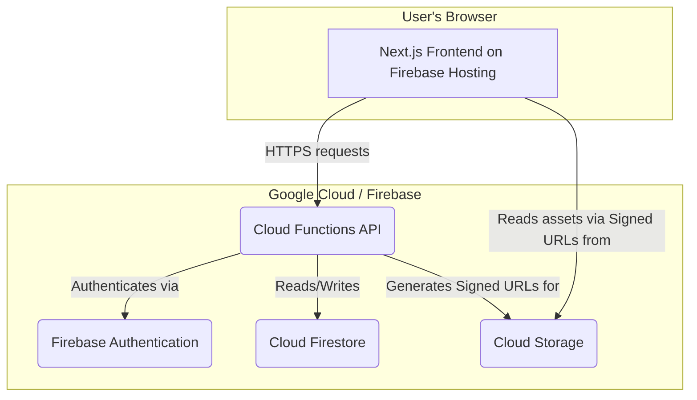

# System Architecture

This document outlines the high-level architecture of the Storytime application, a multi-tenant SaaS platform built on Google Cloud and Firebase.

## Core Components

The system is composed of four main components:

1.  **Frontend Web App:** A Next.js single-page application (SPA) that provides the user interface for families to manage their children and generate stories. It is deployed as a static site on Firebase Hosting.

2.  **Backend API:** A set of serverless Cloud Functions written in Node.js. These functions handle all business logic, including user authentication, data validation, and interactions with other services.

3.  **Database:** A Cloud Firestore database provides the persistence layer for all application data, including user accounts, family structures, and generated stories.

4.  **Storage:** Google Cloud Storage is used to store story templates and generated audio files.

## Architectural Diagram

## Explanation of Flow

1.  The user interacts with the **Next.js Frontend**, which is served globally via the Firebase Hosting CDN.
2.  When the user performs an action (e.g., "generate a story"), the frontend makes a secure HTTPS call to the **Cloud Functions API**.
3.  The API endpoint first verifies the user's identity using **Firebase Authentication**.
4.  The function then performs its business logic, reading from or writing to the **Cloud Firestore** database. All database access is protected by server-side security rules that enforce multi-tenancy.
5.  If the user needs to access a file (like a generated audio story), the API generates a short-lived, secure **Signed URL** for a specific object in **Cloud Storage**.
6.  The frontend receives this Signed URL and uses it to download the asset directly and securely from Cloud Storage. Direct access to the storage bucket is completely blocked by security rules.
